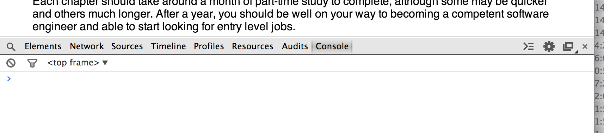

# Preface

This book provides a guide to professional software engineering. It is intended as a guide for complete beginners with
little to no programming experience. It presents a lightning tour of all of the basics that you need to know in order
to start a career in this field, whether you are fresh out of school or considering a career change. It is not meant as
a comprehensive guide, as that would fill several books. Instead, it is a fairly terse introduction to everything you
need to know to be able to fill in the gaps on your own. It is also not an easy course. We will cover a wide range of
topics at a fair pace. There are a lot of good tutorials available on the web that cover this material at a more
relaxed pace if you need to spend more time on any topic.

## Topics Covered

Software Engineering is a complex and wide-ranging subject. There is a lot of material to cover. However, you can get
started pretty quickly and then build from there. The basic outline of this course is as follows. Once you have
completed the first 2 chapters, the remaining chapters can be tackled in almost any order. Each chapter will list any
previous chapters that it requires.

* [What is Software Engineering?](What_is_Software_Engineering.md) In this section, we describe what a job in software
    engineering actual involves: what different career paths are available; the basic day-to-day work performed by a
    software engineer; structure of a typical software development team, and the different job roles involved. We also
    look at the typical life-cycle of a software application.
* Fundamentals Here we dive into some basic programming skills. We introduce Javascript as a first programming language,
    and describe how to set up your first development environment in your web browser. We look at the basics of
    programming, including numbers and arithmetic, manipulating text, defining your own functions, and basic data
    structures and algorithms.
* Web Programming I This section introduces the structure of a Web page. We learn about HTML and CSS for creating and
    styling web pages. We then learn how to manipulate web pages using Javascript. We look at the populate MVC approach
    to Javascript design and introduce some of the popular frameworks.
* Web Programming II In this second part, we look at communication between a web application running in your browser and
    a server. We learn how the HTTP protocol works and how web pages are served to a browser. We write a simple web
    server using Node.js, and connect to it from our web page.
* Software Testing Here we look at how to test your code in order to verify that it does what its supposed to. We cover
    the different types of testing, and in particular look at automated unit and functional testing. We discuss how to
    write code that is easier to test, and how to write effective tests.
* Software Design This section describes how to design software to solve particular functional requirements. We
    introduce notions of modularity, encapsulation, separation of concerns, and cohesion/coupling. We then review
    various basic design patterns.
* Functional Programming This section follows on from the discussion of design patterns to discuss functional
    programming and higher-order functions. These powerful techniques let you write clear code that captures common
    patterns of programming as reusable functions. While not essential, this chapter will make you a better programmer.
* Concurrency discusses how to write programs that do more than one thing at a time. We discuss the problems that can
    occur in such programs and how to avoid them. We look at software designs for concurrent software and discuss pros
    and cons.
* Databases This chapter introduces relational database systems and the SQL language for manipulating and querying them.
    We discuss the basics of the relational model and logic. We then show how to interact safely with a database and
    build some example applications.
* Security provides a basic overview of how to develop secure software. We consider access control techniques and look
    at authentication, authorisation and auditing. We discuss basic public-key cryptography used on the web, and how it
    is used in encryption and signing. We then look at particular attacks against web applications and how to prevent
    them. We review essential best-practice advice for software development.
* Software Architecture looks at how various kinds of software are structured at the highest level. We discuss
    non-functional requirements and how these relate to software architectures. We look at the difference between
    logical and physical architectures. We briefly discuss web services and REST.
* Software Maintenance looks at techniques for managing a large piece of software over time. It discusses debugging —
    how to track down software defects from problem reports; how to refactor software to improve its design or add new
    features; and, how to profile software to determine where its performance can be improved.
* Tools discusses the various tools that are used by software engineers in day-to-day work: integrated development
    environments (IDEs) and text editors, version control systems, bug and issue tracking systems, debuggers, and
    profilers.
* Programming Paradigms is a round up of different approaches to programming and different types of programming
    languages. We discuss imperative and declarative languages, logic and functional programming, dynamic and static
    typing, and other differences. We review some of the different languages in each category that might be encountered
    in your work.
* Computer Science is a round up of more theoretical material that is useful for software engineers. This chapter is
    just a basic introduction with pointers to follow up material for further study. Topics covered include languages
    and automata, logic, discrete mathematics, algorithm analysis, and basic artificial intelligence.

Each chapter should take around a month of part-time study to complete, although some may be quicker and others much
longer. After a year, you should be well on your way to becoming a competent software engineer and able to start
looking for entry level jobs.

## Getting Started

To work through the examples in this tutorial, you will need a modern web browser with Javascript developer tools. We
have used [Google Chrome](https://www.google.com/chrome) version 33.0 for our testing. To enable the Javascript console,
from the menu select View > Developer > JavaScript Console. This will open a view at the bottom of the page, looking
like this:

You can type JavaScript expressions directly into the console and press Return to see the results interactively. We will
show interactive examples in a box like the following. The code after the > character is what you type in, and the next
line shows the result that you should get from the console:

    > 1 + 1
    2

You now have everything you need to begin!
